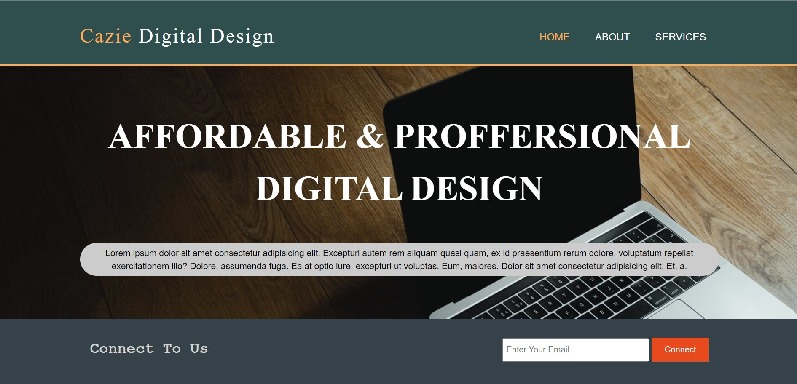

# Cazie-Digital-Design

## Table of contents

- [The challenge](#the-challenge)
  - [Screenshot](#screenshot)
  - [Links](#links)
  - [Built with](#built-with) 
- [Author](#author)

### The challenge

Users should be able to:

- View the optimal layout depending on their device's screen size
- See hover and focus states for interactive elements
- Could input their email to connect with them
- Could send them a message if they have any inquires about the services they offered.

### Screenshot

### Links

- Live Site URL: [Go to site](https://jeffabenoja.github.io/Cazie-Digital-Design/)

### Built with

- Semantic HTML5 markup
- CSS custom properties

## Author

- Frontend Mentor - [@jeffabenoja](https://www.frontendmentor.io/profile/jeffabenoja)
- Facebook - [@wazsupabenoja](https://www.facebook.com/wazsupabenoja)
- LinkedIn - [@jeffabenoja](https://www.linkedin.com/in/jeffabenoja/)
